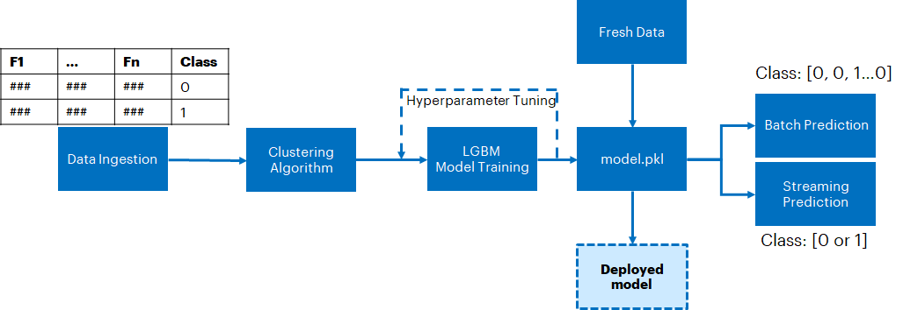
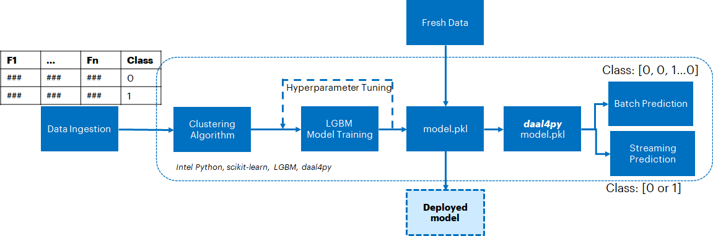
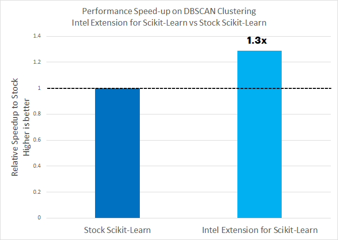
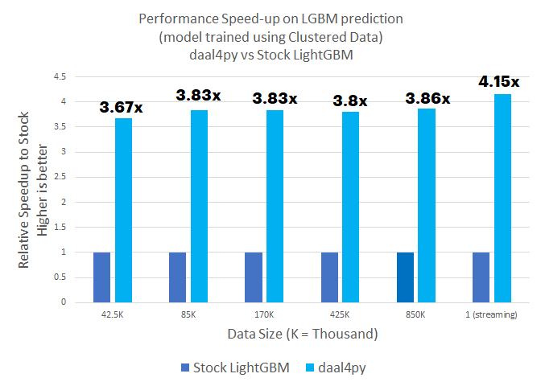
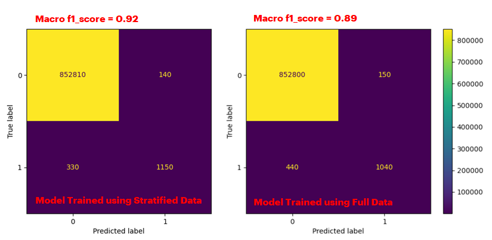

# **Fraud Detection using an ensemble technique - Intel optimized DBSCAN clustering followed by Light Gradient Boosted Model (LGBM)**

Credit card transactions can be stratified using DBSCAN clustering. The stratified data then can be used to train an LGBM model to identify fraudulent transactions. The Intel AI Analytics Toolkit (AI Kit) gives data scientists, AI developers, and researchers familiar Python tools and frameworks to accelerate end-to-end data science and analytics pipelines on Intel architectures. The components are built using oneAPI libraries for low-level compute optimizations.We will use the The Intel Extension for Scikit-learn and daal4py to accelerate the clustering and inference stages of this solution.


# **Table of Contents**
 - [Purpose](#purpose)
 - [Reference Solution](#reference-solution)
 - [Python Scripts and Jupyter Notebook](#python-scripts-and-jupyter-notebook)
 - [Comparing Performance Benefits](#comparing-performance-benefits)
 - [Key Takeaways](#key-takeaways)
 - [Appendix](#appendix)

## **Purpose**

For many banks, retaining a high number of profitable customers is the number one business goal. Credit Card fraud, however, poses a significant threat to this goal. In terms of substantial financial losses, trust and credibility, this is a concerning issue to both banks and customers alike. Due to the steep increase in banking frauds, it is the need of the hour to detect these fraudulent transactions in time in order to help consumers as well as banks. The number of fraudulent transactions has been on an increasing trajectory. Machine learning (ML) can play a vital role in detecting fraudulent transactions and considering the scale at which these transactions happen, an ML approach is a commonly implemented solution. The automation pipeline needs, to be accurate, offer fast inferencing times and have a lower memory usage. These objectives can be realized using an ensemble modeling technique, which will include clustering followed by supervised ML.

## **Reference solution**

For the supervised ML portion we can use Light Gradient Boosted Model (LGBM) which is a lightweight version of gradient boosted models. daal4py can be used to reduce the inference time. Prior to LGBM, we will stratify the data using DBSCAN clustering. This will help improve the accuracy of the supervised ML model.

This section provides key implementation details on the proposed reference solution for the target use case. It is organized as follows:

1. Proposed reference end-to-end architecture
2. Setting up the stock environment
3. Executing the reference architecture pipeline components (Data Ingestion, DBSCAN clustering, supervised ML training, hyperparameter tuning, inference)
4. Optimizing the reference solution pipeline using libraries from the  Intel AI Analytics Toolkit.


### **Proposed Architecture**
A schematic of the proposed reference architecture is shown in the following figure. We start off with Data Ingestion followed by DBSCAN clustering. Data pertaining to select clusters which have the maximum ratio of fraudulent transactions are then chosen for LGBM based supervised ML training and hyperparameter tuning. 

DBSCAN Clustering is used here to "enhance" the ingested data and improve accuracy on unseen test data. Hyperparameter tuning with cross validation is included to optimize the model configuration and further enhance prediction accuracy on test data - it will directly provide the best performing model configuration for running inference.

This trained LGBM model can then be used for Streaming/Batch Prediction. 

The model can then be saved on a server which can respond to requests from a client.  <br>


### **Stock Packages Used**
- Python v3.9
- Pandas v1.4.3
- numpy v1.23.1
- scikit-learn v1.1.2
- LightGBM v3.3.2

### **Setting up Stock Environment**

Clone the git repository using the following command:
```shell
git clone https://www.github.com/oneapi-src/credit-card-fraud-detection

chmod o+w credit-card-fraud-detection/
```
Once repo is cloned, navigate to the parent directory. The reference kit can be ran on a docker container or using conda environments. 
To install it on a docker container go to the docker directory and run: 
```shell
 chmod +x setup.sh
 ./setup.sh
```
The first time it is used, the command will create and run a docker container with the current repository data. After the first time, the command will only run the previously created container. The container will have installed the Stock and Intel® environments, and will be able to run the reference kit Jupyter Notebook. 

If a rebuild of the docker image is needed the -b flag can be used. And for changing the Jupyter Notebook's port -p flag followed by the port number can be used (by default the assigned port is 8888). Both flags can be used together of separately, e.g.
```shell
 ./setup.sh -b -p 8080
```
The other alternative is to use conda environments. The script `setupenv.sh` is provided to automate the setup of the conda environments necessary. Once you clone the git repo on your workstation/virtual machine (VM), in the parent directory, execute the following commands

```shell
chmod +x setupenv.sh 
./setupenv.sh
```
This will prompt for the selection of stock/intel packages. Select 1 for stock

Example option selection for creating stock/intel environment as given below
```shell
Select technology distribution:
    1. stock
    2. intel
```
Once the environment is setup, activate the stock environment using the following command.

```shell
conda activate FraudDetection_stock
```
You can then move ahead to [training](#python-scripts-and-jupyter-notebook) an LGBM model using stock packages.

## **Optimizing the Reference solution using libraries from the  Intel AI Analytics Toolkit**

The reference solution architecture for an Intel-optimized pipeline is largely unchanged except the execution using Intel optimized libraries and the inference using daal4py module. <br>


The **expected output** for the optimized is also similar to what we observer for the stock pipeline except for the accelerated times. This will be discussed more in the section for [Comparing Performance Benefits](#comparing-performance-benefits)

### **Intel Packages Used**

- intelpython3_full v2022.1.0
- Python v3.9
- Pandas v1.3.5
- numpy v1.21.4
- Intel Extension for Scikit-Learn v2021.6.0
- LightGBM v3.3.2
- daal4py v2021.6.0

#### **Intel® Distribution for Python**

The Intel® Distribution for Python provides an accelerated version of Python that leverages the expanded instruction set of Intel® hardware as well as Intel® Performance Libraries to improve near native-performance.

#### **Intel® Extension for Scikit-learn**

Intel® Extension for Scikit-Learn* provides a seamless way to accelerate the stock scikit-learn packages for machine learning. This extension package dynamically patches scikit-learn estimators to use Intel® oneAPI Data Analytics Library (oneDAL) as the underlying solver, which helps accelerate training and inference performance.

#### **daal4py**

daal4py is part of the  Intel oneAPI DAL library. daal4py converted LGBM models offer signigicant advantage in inferencing over stock models. This can be vital while serving a model on an edge location which has to handle a high influx of requests from a client.

### **Setting up Intel Environment**

Follow the same instructions as the ones for setting up a stock environment. Execute the following commands

```shell
chmod +x setupenv.sh 
./setupenv.sh
```
This will prompt for the selection of stock/intel packages. Select 2 for intel.

```shell
Select technology distribution:
    1. stock
    2. intel
```
Once the environment is setup, activate the intel environment using the following command.

```shell
conda activate FraudDetection_intel
```
You can then move ahead to [training](#python-scripts-and-jupyter-notebook) an LGBM model using intel packages. 

## **Python Scripts and Jupyter Notebook**
To run the Python benchmark scripts for this reference kit you can find the instructions in the following [GettingStarted.ipynb](GettingStarted.ipynb) Jupyter Notebook. To be able to see the instructions, the Notebook can be displayed by activating either **FraudDetection_stock** or **FraudDetection_intel** environment and running the following command on the parent directory of the reference kit and selecting **GettingStarted.ipynb** from Jupyter's main dashboard
```shell
jupyter notebook
```
Once in **GettingStarted.ipynb**, you can either run the commands by following the instructions on the Notebook.
To run the Notebook from a docker container, execute the following command on the docker directory
```shell
docker-compose up
```
Once in Jupyter's main dashboard you can access the Notebook.

## **Comparing Performance Benefits**

In this section, we illustrate the benchmarking results comparing the Intel-optimized libraries vs the stock alternative as well as the performance of the two LGBM models (one trained using post-clustering data and one trained using the full dataset).  The execution is broken down into the following tasks

  1. Stratifying fraudulent transaction using DBSCAN clustering using stock and Intel-optimized libraries 
  2. Training/Hyperparameter tuning an LGBM model on the full dataset as well as post-clustering dataset
  3. Predicting outcomes over batch data using an LGBM model trained using post-clustered data and full data as well as using stock and Intel-optimized libraries. For inference, the Intel-optimized libraries  involves converting the model to a daal4py version
  4. Repeating the inference exercise but for streaming data

Intel optimizations can be applied to DBSCAN Clustering through Intel Extension for Scikit-Learn and LGBM inference after converting a pre-trained model to a daal4py model.

### **Key Results**
1. There is a 30% acceleration on using the Intel Extension for Scikit-learn for DBSCAN clustering compared to stock scikit-learn
2. Using daal4py accelerates performance by up to 3.86x for batch inference, which is critical in model development. More importantly it is 4.15x faster for streaming inference. This means inference can happen either much quicker or on a less powerful edge location when the model is deployed in the field.
3. The performance benefit of using post-clustering data translates into a higher accuracy. For a model trained using clustered data, we get a higher f1_score (0.92) compared to that for a model trained using the full dataset (0.89). This is significant because of the scale at which financial transactions occur. About 100 million credit card transactions occur every day in the US. Assuming 0.2% (200000) transactions are fraudulent, a 3% better accuracy would mean up to 6000 more transactions would be correctly classified, daily.


#### 1. Executing DBSCAN clustering using stock scikit-learn vs. Intel® Extension for Scikit-Learn



<br>

#### 2. Prediction (batch and streaming) from a stock LGBM model vs conversion to an Intel oneAPI optimized (daal4py) version of the model. Models were trained using clustered dataset



<br>

##### 3. Accuracy benefit of training a model post DBSCAN clustering



### **Key Takeaways**

From the reference kit, we can observe that the Intel Extension for Scikit-learn can accelerate DBSCAN clustering for stratifying the data by 30%. Clustering greatly helps training a more accurate model. For inference, using daal4py instead of stock can accelerate handling batch data by up to 3.86x and streaming data by 4.15x.

Fraud detection can be a compute intensive operation for inference workloads given the scale of credit card transactions occuring in the market. The performance improvement offered by daal4py for inferencing on streaming data on an LGBM model essentially means an enterprise can reduce their computational resources for inference (likely at the edge) at least by a factor of 4. This will greatly reduce their total cost of ownership.

## **Appendix**

### **Experiment Setup**
| **Configuration**:                | **Description**
| :---                              | :---
| Platform                          | Microsoft Azure: Standard_D8s_v5 (IceLake) <br> Ubuntu 20.04
| Processing Hardware               | Intel IceLake CPU
| Software                          | **Stock**: scikit-learn(v1.1.2), lightgbm(v3.3.2) <br> **Intel**: intelpython3_full(v2022.1.0), Intel Extension for scikit-learn(v2021.6.0), lightgbm(v3.3.2), daal4py(2021.6.0)
| What you will learn               | Intel® oneAPI performance advantage over the stock versions on model inference

**Note on the Hardware Infrastructure:** The Azure based D8s_v5 machine was chosen as a typical VM used by customers. Please do not consider this as a recommendation for the workloads benchmarked here. Users are free to choose other architectures as well. However, please keep in mind that the performance gains may vary with the machine charactersistics such as generation, base speed, processor count, memory etc.

### Dataset and Base Code

The dataset used for this demo is a set of ~280K credit card transactions made in September 2013 by European cardholders. The base code was also sourced from Kaggle and can be found at the following location: <br>
https://www.kaggle.com/datasets/mlg-ulb/creditcardfraud


### Additional Remarks

Clustering was performed using two "most important features". The choice can greatly depend on the data and was made by executing a separate training pipeline. Details on that exercise are outside the scope of this project.

For LGBM training, we noticed a trade-off. If we chose to train a highly complex model,  the clustering benefit disappears as the complex model can handle the large dataset by itself. But it will result in longer training times. That being said, clustering parameters were chosen empirically to maximize the proportion of fraudulent transactions. Memory limitations on the machine prevented us to increase the ratio beyond ~30%. Given more memory, it is likely that clustering-based stratification can provide accuracy benefits even for a more complex model.

**Operating System:**
We recommend using an Linux OS for executing the reference solution presented here, e.g. RHEL or Ubuntu.

## **Notes**

**Please see this data set's applicable license for terms and conditions. Intel Corporation does not own the rights to this data set and does not confer any rights to it.**